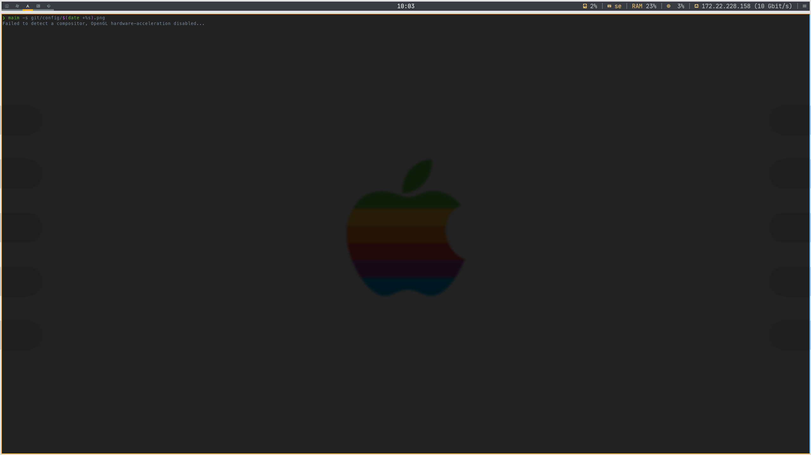

# config

## Sections
1. [TODO list](#todo-list)
2. [Configuration information](#configuration-information)
    1. [X11](#X11)
    2. [Wayland](#wayland)
    3. [Fonts](#fonts)
    4. [Information about installation](#information-about-installation)
3. [Screenshots and videos](#screenshots-and-videos)
    1. [Screenshots](#screenshots)
    2. [Videos](#videos)
4. [Installation](#installation)

### TODO list
- [ ] Implement a separate jgmenurc config for jgmenu when using sway with waybar
- [ ] Customize waybar with different colors and icons using the fonts defined below
- [x] Define the customisation modules and fonts
- [x] Write about the customisation
- [ ] Write about the installation script
- [ ] \*Something else i forgot\*

### Configuration information
Common for both display servers is that we don't use i3 packages or sway. But all packages necessary for switching between those are installed. They both use ly as login screen, which can be found at [https://github.com/fairyglade/ly](https://github.com/fairyglade/). Packages for both installations (both native and foreign) can be found in [native](/native_packages.txt) and [foreign](/foreign_packages.txt). They also use zsh as the default shell and if you are running anything else when running the install script, described later on, then you will be prompted to change to zsh.

#### X11
For X11 server to work you will need i3 (not just i3 but the complete suite of packages), rxvt and one or more external packages. For the external packages you will need:
- [Polybar](https://github.com/polybar/polybar)
- [MesloLGS NF, JetBrainsMono NF](#fonts)

#### Wayland
For wayland to work you will need to install Sway, swayidle, i3lock and following external packages: 
- [Waybar](https://github.com/Alexays/Waybar)
- [MesloLGS NF, JetBrainsMono NF](#fonts)

#### Fonts
There are a variety of fonts used in the configuration of the custom linux build. There is a list of them in [fonts.txt](/fonts.txt), but below are some that are more a requirement if using this type of configuration. See the file where I note what fonts are available in pacman on arch. However for different distributions, you might need separate configuration according to the disrtibution. For example installing the fonts in `~/.local/share/fonts`.
- [JetBrainsMono NF](https://www.nerdfonts.com/font-downloads)
- [MesloLGS NF](https://github.com/romkatv/powerlevel10k-media)
- [Noto Sans](https://fonts.google.com/noto/fonts)

#### Information about installation

### Screenshots and videos
#### Screenshots


#### Videos

### Installation
```
wget -O - https://raw.githubusercontent.com/erikkamph/config/main/install.sh | bash -s -
```
